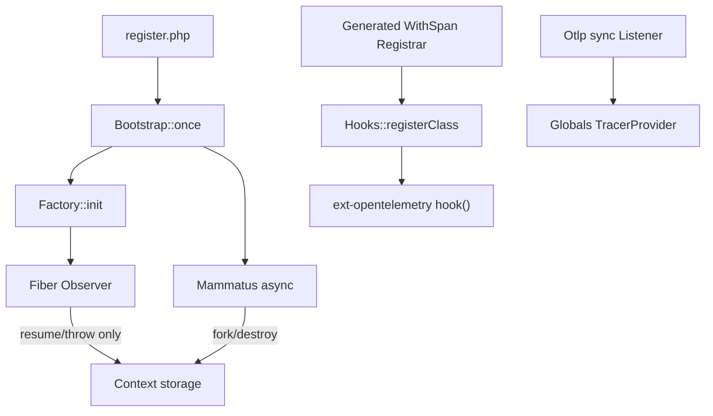

# ADR 001: Fiber context and WithSpan in ReactPHP

## Status

Accepted

## Context

[Mammatus open-telemetry](https://github.com/MammatusPHP/open-telemetry) runs inside [ReactPHP](https://reactphp.org/) applications where work executes in fibers via [`react/async`](https://github.com/reactphp/async). OpenTelemetry context and `#[WithSpan]` instrumentation must survive fiber suspend/resume on both **NTS** and **ZTS** PHP builds without crashing the engine.

Three separate problems interact:

1. **SDK lifetime** — initializing the OpenTelemetry SDK inside an `async()` fiber drops providers when the fiber ends.
2. **Context propagation** — default OpenTelemetry context storage abandons fiber-local scopes on the first `fork()`.
3. **Span hooks** — `opentelemetry.attr_hooks_enabled` with React fibers causes [zend_mm_heap corruption](https://github.com/open-telemetry/opentelemetry-php-instrumentation/pull/313).

## Decision

### Dual runtime paths for context tracking

| Build | `OTEL_PHP_FIBERS_ENABLED` | Context tracking |
|-------|---------------------------|------------------|
| NTS | `true` (CI/docker default) | [ZendObserverFiber](https://opentelemetry.io/docs/languages/php/) — userland stack no-ops |
| ZTS or forced userland | `false` | `Factory` + `Observer` + `Mammatus\OpenTelemetry\async()` |

Detection lives in [`Factory::fibersEnabled()`](../../src/Fiber/Factory.php). When ZendObserverFiber is active, [`Factory::init()`](../../src/Fiber/Factory.php) returns early and [`async()`](../../src/functions.php) delegates to `React\Async\async`.

### Three implementation pillars

#### 1. SDK init stays synchronous

[`Otlp`](../../src/Otlp.php) implements a **sync** [`Listener`](https://github.com/MammatusPHP/life-cycle-events), not `AsyncListener`. `Sdk::buildAndRegisterGlobal()` must not run inside an `async()` fiber or `WithSpan` always hits `NoopTracerProvider`.

#### 2. Userland fiber context (ZTS / `OTEL_PHP_FIBERS_ENABLED=false`)

- [`Factory::init()`](../../src/Fiber/Factory.php) replaces context storage and wraps React's fiber factory with [`Observer`](../../src/Fiber/Observer.php).
- [`async()`](../../src/functions.php) forks a fiber-local context on entry and destroys it on exit via `MAIN_CONTEXT_KEY`.
- [`Observer::suspend()`](../../src/Fiber/Observer.php) must **not** switch or destroy context — only `resume()` and `throw()` restore the fiber fork. Suspend must leave `#[WithSpan]` scopes attached to the active head.

#### 3. WithSpan via `hook()`, not attr_hooks

- [`opentelemetry.attr_hooks_enabled=Off`](../../etc/qa/zzz_disable_otel_attr_hooks.ini) globally.
- [`Hooks::registerClass()`](../../src/WithSpan/Hooks.php) registers `WithSpanHandler` via [`OpenTelemetry\Instrumentation\hook()`](https://github.com/opentelemetry-php/opentelemetry-php-instrumentation).
- Classes are discovered at `composer install` and registered through a generated [`WithSpan/Registrar.php`](../../etc/generated_templates/WithSpanRegistrar.php.twig).
- The post hook must not typehint `?Throwable` — fiber teardown passes `GracefulExit`/`UnwindExit` and a typehint would skip the hook.

### Monkey-patch of `React\Async\async`

**Keep** the [`MonkeyPatcher`](../../src/Composer/MonkeyPatcher.php) generative plugin. It rewrites `React\Async\async` references to `Mammatus\OpenTelemetry\async` in dependent packages so existing Mammatus apps need no import changes.

**Trade-off:** zero-config vs magic. Debugging "why is async different?" costs more; removing the patch would require explicit `use function Mammatus\OpenTelemetry\async` across consumers.

Protected from patching: `src/functions.php`, plugin sources.

### Bootstrap

[`src/register.php`](../../src/register.php) is the Composer `files` autoload entry (Windows-safe name). It calls [`Bootstrap::once()`](../../src/Bootstrap.php) which registers transport factories, loads `functions.php`, and calls `Factory::init()`.

## CI and portability

- **`unit-testing-raw`** and **`mutation-testing`**: CI sets `OTEL_PHP_FIBERS_ENABLED` per matrix (`false` on ZTS, `true` on NTS). [WyriHaximus/makefiles](https://github.com/WyriHaximus/makefiles) must use `OTEL_PHP_FIBERS_ENABLED?=` (not `=`) so step `env` wins; otherwise Make overrides it, ZendObserverFiber notices on ZTS contain `8.1`, Infection mis-detects PHPUnit `8.1`, emits a legacy `<filter>` config, and mutation testing fails under PHPUnit 13's `failOnWarning`. Regenerate the project Makefile via `make update` after bumping `wyrihaximus/makefiles`.
- Until all repos pick up that makefiles release, [WyriHaximus/github-workflows](https://github.com/WyriHaximus/github-workflows) also passes `OTEL_PHP_FIBERS_ENABLED` on the **`make` command line** (CLI overrides Makefile `=`). Makefiles `0.14.4` switched to `?=` but `RequirementConditionalInjector` must expand `?=when_in_requirements(...)` too; otherwise generated Makefiles keep raw template syntax and Windows `make` fails.
- **Subprocess tests**: [`SyncAwaitProcessTest`](../../tests/Fiber/SyncAwaitProcessTest.php) forces userland (`OTEL_PHP_FIBERS_ENABLED=false`) in the child: Unix passes an explicit `proc_open` env array; Windows uses `set OTEL_PHP_FIBERS_ENABLED=false&& php …` (no nested `cmd /C "…"` quoting — `putenv()`/inherited env are unreliable on Windows CI). ZendObserverFiber emits notices to stdout on Windows (and ZTS). Child PHP also uses `-d display_errors=0`.
- **`ext-opentelemetry`** must be in [`composer.json`](../../composer.json) `require` so CI `setup-php` installs it.
- **PHPUnit isolation**: tracer tests reset `Globals` and detach all context scopes between cases.

ZTS CI matrix comes from [WyriHaximus github-workflows threading matrix](https://github.com/WyriHaximus/github-workflows/blob/main/.github/workflows/supported-threading-matrix.yaml), not from `composer.json` `extra.wyrihaximus.supported-features`.

## Consequences

### Positive

- Traces and `#[WithSpan]` work across React fiber suspend/resume on NTS and ZTS.
- No attr_hooks heap corruption under fibers.
- Zero-config async wrapping for Mammatus packages via Composer plugin.

### Negative

- Two context code paths to understand and test.
- Monkey-patch adds Composer plugin complexity and serialized-state coupling (`Item` DTO cache).
- Userland path requires explicit `ContextStorage` replacement (OpenTelemetry BC detail).

## Upstream tracking

When [opentelemetry-php-instrumentation#313](https://github.com/open-telemetry/opentelemetry-php-instrumentation/pull/313) lands, revisit whether `Hooks` + global attr_hooks-off remain necessary on NTS builds.
